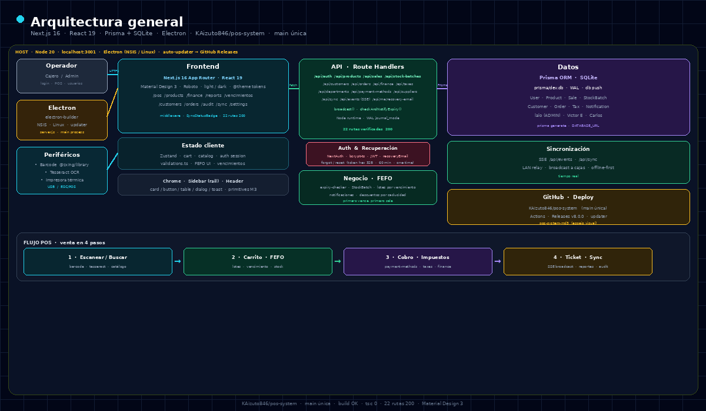
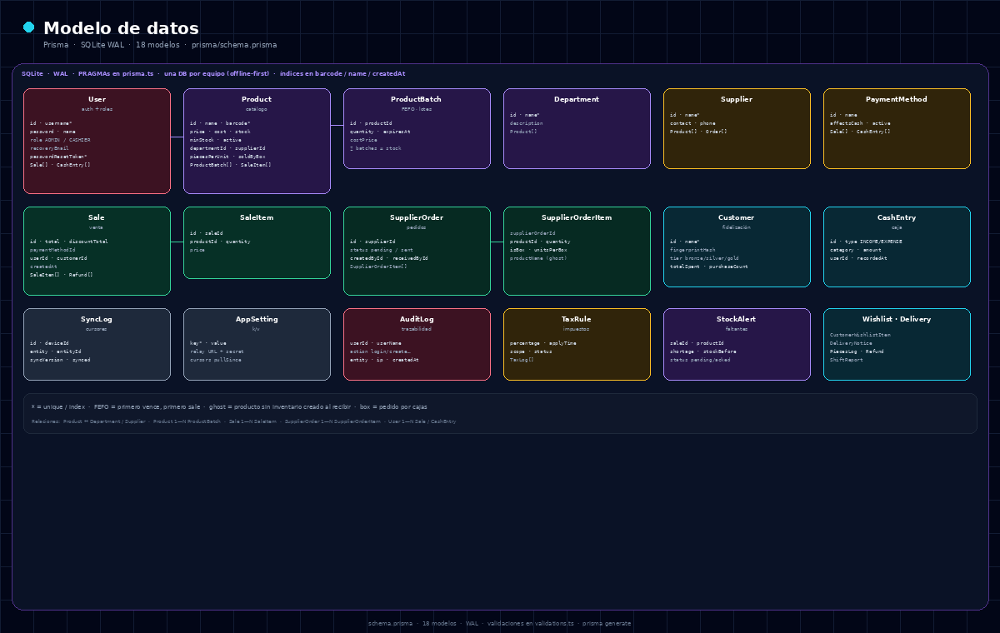
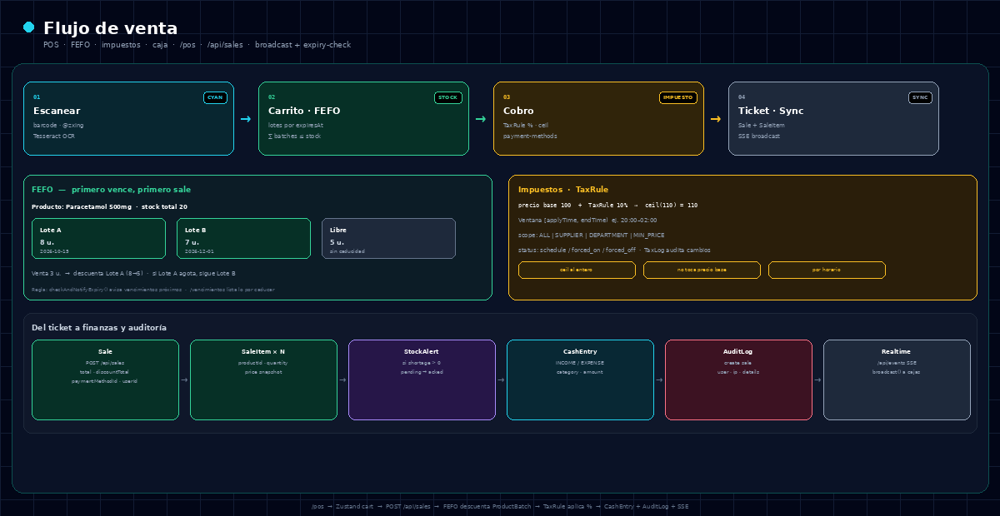
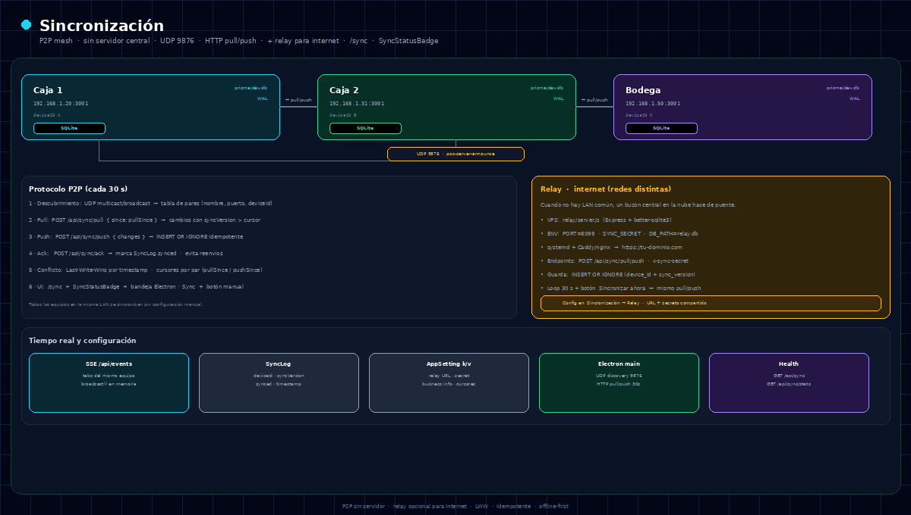
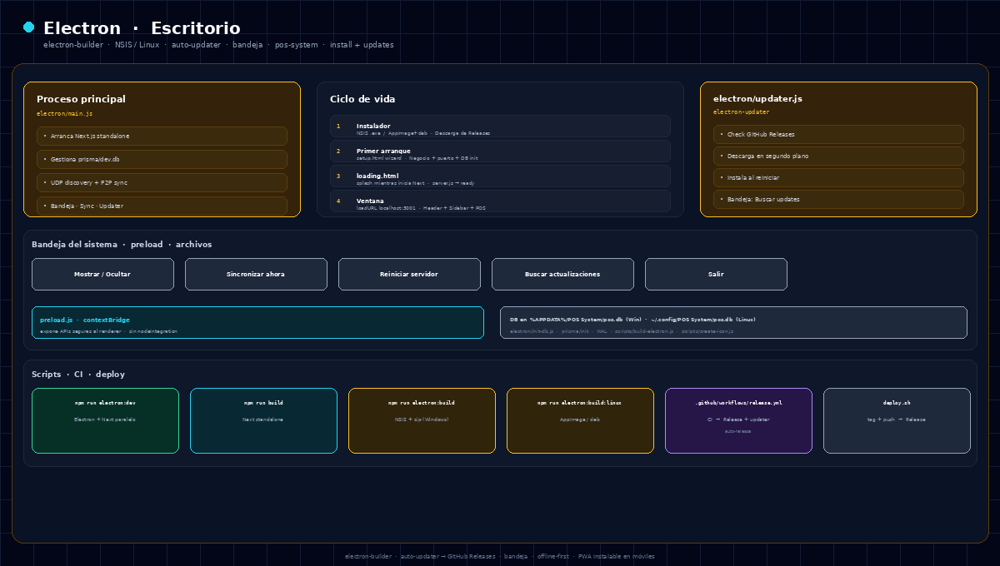
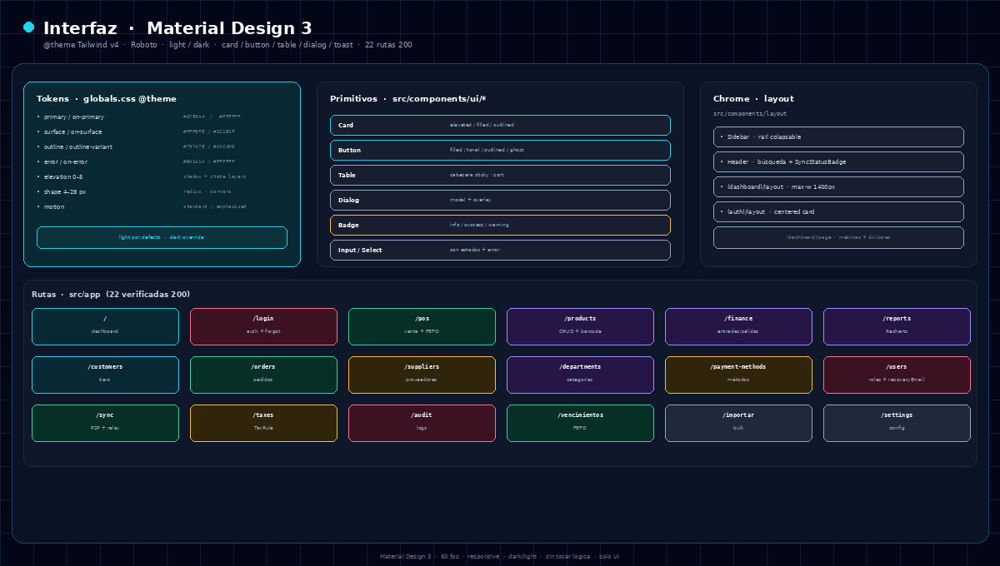

# POS System — Sistema de Punto de Venta

[](https://www.typescriptlang.org/)
[](https://nextjs.org/)
[](https://www.prisma.io/)
[](https://www.electronjs.org/)
[](LICENSE)

Sistema de punto de venta para pequeñas y medianas empresas.

Construido con Next.js 16, React 19, Prisma y SQLite. Empaquetado como aplicación de escritorio con Electron para Windows y Linux. Funciona offline con una base de datos por equipo y sincronización entre dispositivos en la misma red, sin servidor central.


## Arquitectura



Frontend en Next.js 16 con Material Design 3. API mediante Route Handlers. Datos en Prisma con SQLite en modo WAL. Electron orquesta el proceso principal, el descubrimiento por UDP y la sincronización. La interfaz incluye 22 rutas verificadas y un flujo de venta en cuatro pasos que termina con broadcast por SSE.


## Modelo de datos



Esquema en `prisma/schema.prisma` con 18 modelos. Product gestiona precio, stock, código de barras y variantes por piezas y por caja. ProductBatch implementa FEFO con lotes ordenados por vencimiento. Sale y SaleItem registran cada ticket. Supplier y SupplierOrder cubren el ciclo de compras. Customer añade fidelización por niveles. SyncLog, AppSetting y AuditLog sostienen la sincronización y la trazabilidad.


## Flujo de venta



El carrito valida contra ProductBatch aplicando FEFO: primero vence, primero sale. Al confirmar la venta, el sistema descuenta los lotes correspondientes, aplica TaxRule con redondeo hacia arriba y genera Sale, SaleItem, CashEntry y AuditLog. Si hay faltante, crea StockAlert. Finalmente emite un evento por SSE para actualizar las demás cajas en tiempo real.


## Sincronización



Cada equipo es un par igual. Se descubren por UDP multicast en el puerto 9876 y sincronizan cada 30 segundos mediante pull y push por HTTP. El cursor por dispositivo evita reenvíos y Last-Write-Wins resuelve conflictos.

Cuando los equipos están en redes distintas, un relay opcional actúa como buzón central. Se despliega en un VPS con Express y better-sqlite3 y se configura en Sincronización → Relay con URL y secreto compartido.


## Escritorio



Electron empaqueta la aplicación con electron-builder. El instalador es NSIS en Windows y AppImage o deb en Linux. En el primer arranque muestra el wizard de configuración. El proceso principal levanta Next.js en modo standalone, gestiona la base de datos y expone la bandeja del sistema con acciones de sincronización y actualización.

Las actualizaciones se distribuyen desde GitHub Releases mediante electron-updater.


## Interfaz



Diseño basado en Material Design 3 con Tailwind v4 y tokens definidos en `@theme`. Tipografía Roboto con tema claro y oscuro. Primitivos propios para Card, Button, Table, Dialog y Toast. Layout con Sidebar en rail y Header con indicador de sincronización. Dashboard con métricas, POS con lector de código de barras y OCR, y módulos dedicados para productos, finanzas, clientes y auditoría.


## Estructura

```
pos-system/
├── prisma/schema.prisma        # Esquema y migraciones
├── electron/main.js            # Proceso principal
├── src/app/(dashboard)/        # POS, productos, finanzas, reportes
├── src/app/api/                # Route Handlers por módulo
├── src/components/ui/          # Primitivos M3
├── src/lib/sync-engine.ts      # Motor de sincronización
├── relay/server.js             # Relay opcional
└── docs/images/                # Diagramas del proyecto
```


## Instalación

Requisitos: Node.js 20 y npm 10.

```bash
git clone https://github.com/KAizuto846/pos-system.git
cd pos-system
npm install
npx prisma migrate deploy
npm run dev
```

La aplicación queda en http://localhost:3000. Para desarrollo con Electron:

```bash
npm run electron:dev
```


## Variables de entorno

Copia `.env.example` a `.env` y ajusta:

| Variable | Descripción | Ejemplo |
|---|---|---|
| `AUTH_SECRET` | Secreto para sesiones JWT | `cambiar-por-un-secreto-seguro` |
| `DATABASE_URL` | Ruta a SQLite | `file:./prisma/dev.db` |
| `AUTH_URL` | URL base | `http://localhost:3000` |
| `SYNC_SECRET` | Secreto compartido para sync | `mi-secreto-sync` |


## Licencia

MIT. Consulta [LICENSE](LICENSE).

---

<div align="center">
  <sub>Construido con Next.js, Prisma y TailwindCSS</sub><br/>
  <sub>© 2026 POS System</sub>
</div>
